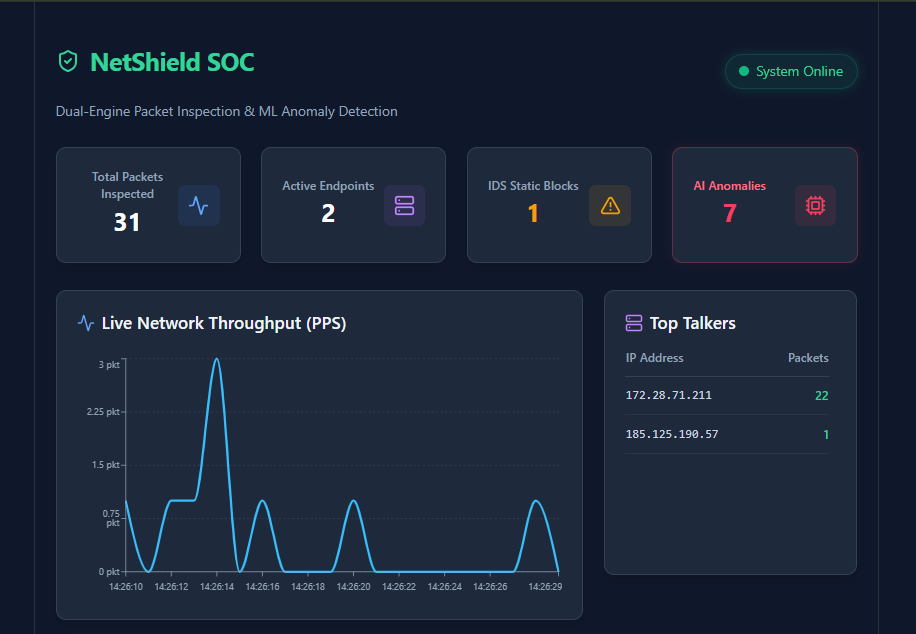
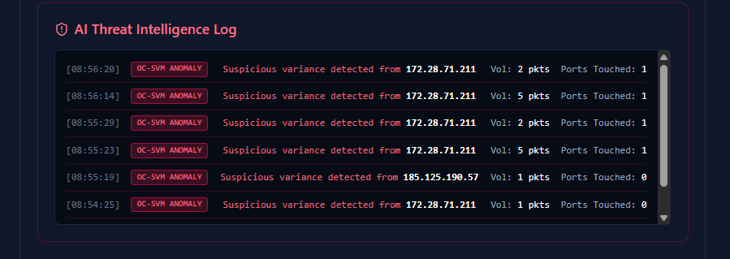

# NetShield: AI-Powered Network Intrusion Detection & SOC Platform

This document explains **everything** about the NetShield project—from basic networking and machine learning concepts to the complete full-stack architecture. Whether you are a recruiter, a thesis reviewer, or a developer, this guide will help you understand exactly how data flows through the system.

---

### Project UI Preview

| Dashboard Overview | Anomaly Detection Log |
| :---: | :---: |
|  |  |

## Table of Contents

1. [What is NetShield?](#1-what-is-netshield)
2. [Networking & AI Background](#2-networking--ai-background)
3. [System Architecture](#3-system-architecture)
4. [File Structure](#4-file-structure)
5. [The Journey of a Packet (C++ Core Engine)](#5-the-journey-of-a-packet-c-core-engine)
6. [The Journey of Features (Python ML Pipeline)](#6-the-journey-of-features-python-ml-pipeline)
7. [The Real-Time SOC (React Frontend)](#7-the-real-time-soc-react-frontend)
8. [Building and Running](#8-building-and-running)
9. [Simulating a Cyber Attack](#9-simulating-a-cyber-attack)

---

## 1. What is NetShield?

**NetShield** is a high-performance, full-stack Network Intrusion Detection System (IDS). Unlike traditional firewalls that rely strictly on hardcoded rules, NetShield uses **Unsupervised Machine Learning** to dynamically learn the baseline behavior of a network and detect zero-day anomalies (like DDoS attempts or stealthy port scans) in real-time.

### Real-World Use Cases:
- **Enterprise Security**: Monitoring internal networks for unauthorized scanning.
- **Data Centers**: Detecting SYN flood attacks before they crash web servers.
- **Security Operations Centers (SOC)**: Providing real-time visual threat intelligence to security analysts.

---

## 2. Networking & AI Background

To understand this project, you need to know two core concepts: The Five-Tuple and Anomaly Detection.

### The Five-Tuple (Networking)
Every network connection (or "flow") is uniquely identified by 5 values:
1. **Source IP** (Who is sending)
2. **Destination IP** (Where it's going)
3. **Source Port** (Sender's application)
4. **Destination Port** (Service being accessed, e.g., 443 for HTTPS)
5. **Protocol** (TCP or UDP)

*NetShield tracks these flows in real-time to calculate statistics like Packets Per Second (PPS) and unique ports touched.*

### Unsupervised Machine Learning (AI)
Traditional antiviruses use *signatures* (known bad patterns). If a new, never-before-seen attack (Zero-Day) occurs, they miss it. 
NetShield uses a **One-Class Support Vector Machine (OC-SVM)**. 
- It observes "normal" traffic.
- It draws a multi-dimensional mathematical boundary around this normal behavior.
- If traffic suddenly shifts outside this boundary (e.g., 500 ports touched in 1 second), it flags it as an **Anomaly**, even if it has never seen that specific attack before.

---

## 3. System Architecture

NetShield is built on a **Tri-Plane Architecture** that bridges low-level system programming, artificial intelligence, and modern web development.

```text
┌─────────────────────────────────────────────────────────┐
│                 DATA PLANE (C++ Engine)                 │
│  - Captures raw packets via libpcap                     │
│  - Parses Ethernet/IP/TCP headers                       │
│  - Serves basic stats on Port 8080 (C++ httplib)        │
│  - Exports flow features to CSV asynchronously          │
└──────────────────────────┬──────────────────────────────┘
                           │ (CSV Data Stream)
                           ▼
┌─────────────────────────────────────────────────────────┐
│               CONTROL PLANE (Python AI)                 │
│  - Memory-safe rolling window (keeps last 1000 points)  │
│  - Normalizes data via StandardScaler                   │
│  - OC-SVM predicts anomalies (-1) or normal (1)         │
│  - Serves Threat Intelligence on Port 8081 (Flask)      │
└──────────────────────────┬──────────────────────────────┘
                           │ (REST APIs)
                           ▼
┌─────────────────────────────────────────────────────────┐
│             MANAGEMENT PLANE (React Vite UI)            │
│  - Polls Port 8080 and 8081 every second                │
│  - Renders live PPS charts (Recharts)                   │
│  - Displays Active IPs and AI Threat Logs               │
└─────────────────────────────────────────────────────────┘

## 4. File Structure

```text
NetShield/
├── build/                        # C++ Compilation Directory & CSV data stream
├── include/                      # C++ Header files (httplib.h, rule_manager.h, etc.)
├── ml_env/                       # Python Virtual Environment
├── netshield-ui/                 # React Frontend Workspace
│   ├── src/
│   │   ├── App.jsx               # Main Dashboard Component
│   │   └── index.css             # Tailwind configurations
│   ├── package.json
│   └── tailwind.config.js
├── src/                          # C++ Source Code
│   ├── main.cpp                  # Multi-threaded C++ Entry Point
│   ├── pcap_reader.cpp           # libpcap integration
│   └── packet_parser.cpp         # Deep packet inspection logic
├── tests/                        # C++ Unit testing files (TDD)
├── CMakeLists.txt                # CMake build configuration
├── generate_test_pcap.py         # Python utility to generate test packets
├── ml_detector.py                # Python Machine Learning Daemon
└── README.md                     # Project documentation


## 5. The Journey of a Packet (C++ Core Engine)

1. **Promiscuous Sniffing:** The C++ engine binds to a network interface (e.g., `eth0`) using `libpcap` and captures raw binary data directly from the NIC.
2. **Byte Parsing:** It strips the Ethernet header (14 bytes), reads the IP header (20 bytes) to get Source/Dest IPs, and reads the TCP header to get port numbers.
3. **Flow Tracking:** The packet's 5-Tuple is hashed and mapped to an active connection table.
4. **Feature Extraction:** A dedicated C++ background thread wakes up every few seconds, calculates traffic variance (total packets, SYN flags, unique ports), and writes this strictly formatted data to `traffic_features.csv`.
5. **API Broadcasting:** Another C++ thread runs a lightweight HTTP server, exposing `total_packets` and `active_ips` as a JSON response on port `8080`.


## 6. The Journey of Features (Python ML Pipeline)

1. **Rolling Window Ingestion:** The `ml_detector.py` script reads the CSV. To prevent Out-Of-Memory (OOM) crashes during continuous production runs, it enforces a strict rolling window, dropping data older than 1,000 rows.
2. **Dynamic Baseling:** It pushes the raw numbers through Scikit-Learn's `StandardScaler` to normalize the data.
3. **Continuous Retraining:** It fits the `OneClassSVM` to the scaled baseline. The model retrains automatically every 50 ticks to adapt to changing "normal" network conditions.
4. **Anomaly Scoring:** New data points are fed into the SVM. If the algorithm outputs a `-1`, it registers a Zero-Day mathematical anomaly.
5. **Threat Dispatch:** The anomaly is immediately appended to an internal list, which is broadcasted to the frontend via a Flask background thread running on port `8081`.


## 7. The Real-Time SOC (React Frontend)

The frontend transforms raw backend data into actionable threat intelligence.
- **Tech Stack:** React (Vite), Tailwind CSS, Recharts, Lucide Icons.
- **State Management:** Uses `useRef` to track cumulative packet counts without disrupting the `setInterval` polling loop.
- **Visuals:** Features a live Packets-Per-Second (PPS) line chart, a dynamically sorting Top Talkers IP table, and a dedicated Red-Team AI Anomaly Log that flashes when the SVM detects an attack.
- **Demo Mode:** Includes a built-in toggle that simulates live network traffic, randomized IP generation, and fake AI anomaly triggers. This allows recruiters to experience the full dashboard UI via cloud hosting (e.g., Vercel) without needing the local C++ system engine running.


## 8. Building and Running

### Prerequisites
- Linux/WSL Environment
- C++17 Compiler & `libpcap-dev`
- Python 3 & `venv`
- Node.js & npm

### Step 1: Start the C++ Engine
```bash
cd build
sudo ./packet_analyzer -i eth0
```

### Step 2: Start the Python AI Pipeline
Open a second terminal window:
```bash
cd build
source ml_env/bin/activate
python3 ml_detector.py
```
*(Wait a few seconds for it to gather baseline traffic and output `[+] AI Model Active`)*

### Step 3: Start the React Dashboard
Open a third terminal window:
```bash
cd netshield-ui
npm run dev
```
Navigate to `http://localhost:5173` in your web browser to view the live SOC.


## 9. Simulating a Cyber Attack

To prove the AI actually works, you can launch a simulated Port Scan attack against the network while watching the dashboard.

1. Ensure the system is running and the baseline is established (the dashboard chart should be relatively flat/quiet).
2. Open a new terminal and use Netcat to scan a range of ports aggressively:
   ```bash
   nc -zv 8.8.8.8 80-200
   ```
3. **Watch the Dashboard:** - The PPS chart will instantly spike.
   - The Python SVM will catch the abnormal variance in "unique ports touched".
   - A red `OC-SVM ANOMALY` warning will instantly populate in the Threat Intelligence Log identifying the offending IP.

---

## Future Development Roadmap

The platform is designed to be highly scalable. Planned future integrations include:
- **Redis Integration:** Replacing the CSV file bridge with Redis in-memory caching for sub-millisecond IPC.
- **Database Persistence:** Connecting a MongoDB or Supabase backend to permanently log historical AI anomalies for long-term threat hunting.
- **Automated Mitigation:** Linking the Python AI output directly to Linux `iptables` to automatically drop traffic from anomalous IPs in real-time.


